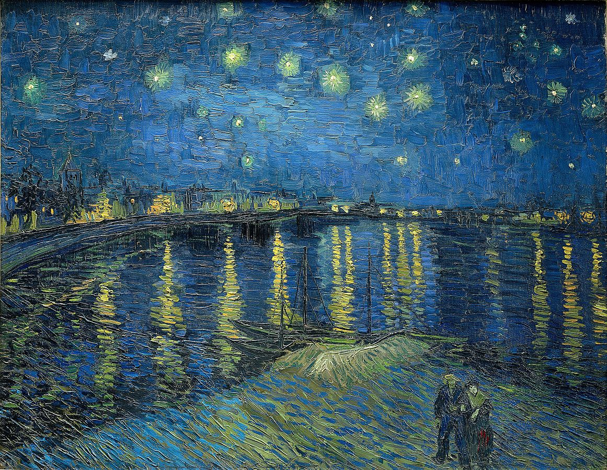

# Hello World!

This is a sample Github page for my DATA 410 class. Here is a picture of my favorite painting.



## How does the mass from stars turn into light we can see?


## What does that *c* stand for?

```Python
c = 3.0 * (10**8) # In meters per second
```
